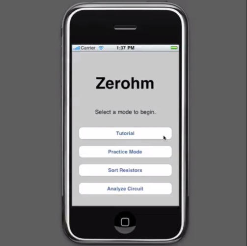
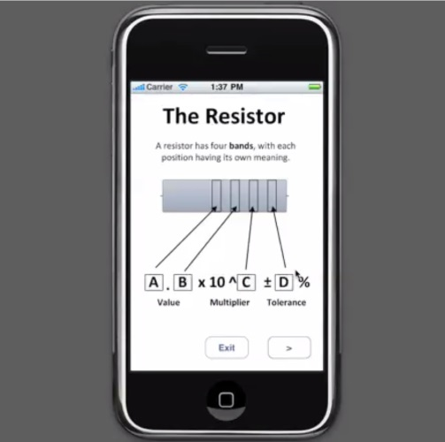
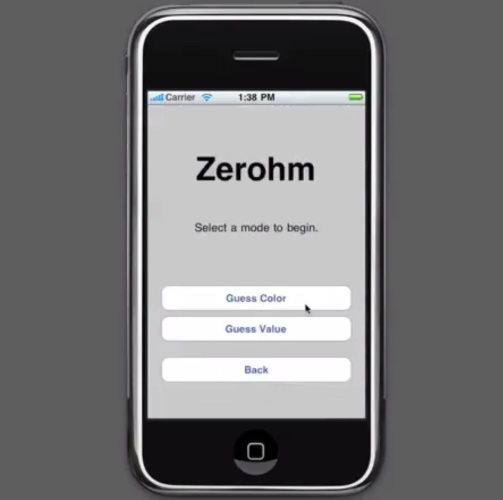
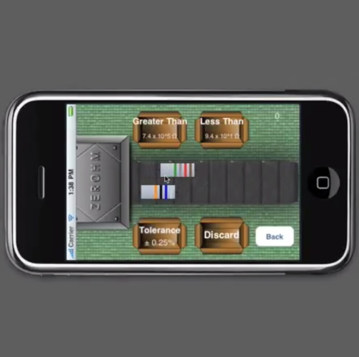

## Zerohm ##

Zerohm is an iPhone game designed to help science and engineering students learn the resistor color band codes, a fundamental identification system in the field of electronics.

### Development ###

The game was originally developed with XCode 3.1 for iPhone 3.1.

### Gameplay ###

The game includes a `Tutorial`, `Practice Mode` and two game levels: `Sort Resistors` and `Analyze Circuit`.

The `Tutorial` explains the theory behind resistor color codes and the requirements of the game in the various levels.

The `Practice Mode` includes two options:

1. To guess the color codes given the resistance value
2. To guess the resistance value given the color codes.

##### Sort Resistors #####

In the `Sort Resistors` level, players have to sort the resistors as quickly as possible as they come out of the assembly line. The resistors will have to be placed into boxes based on the resistance and/or tolerance values. Failure to sort 3 resistors will result in defeat.

##### Analyze Circuit #####

In the `Analyze Circuit` level, players have to correctly identify broken resistors using two-fingers either side of a resistor, much like a multimeter. Once identified, players will be taken to a second screen in which they will have to create the correct resistor by placing the color bands in the correct positions.

